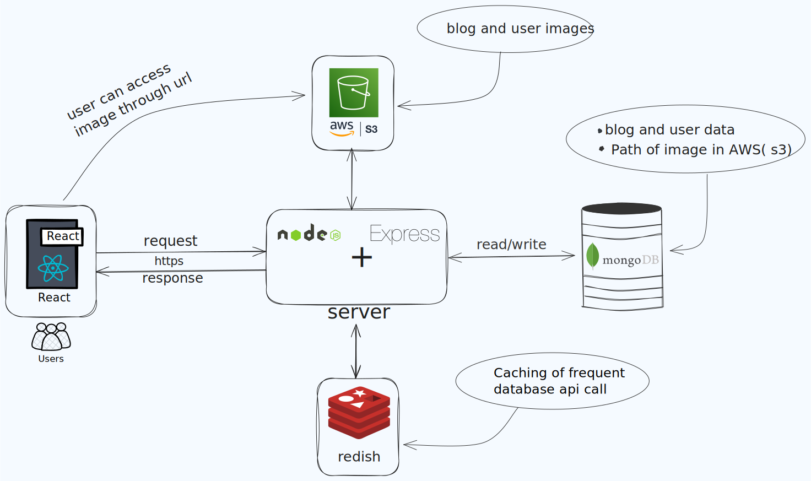

# Blogging Website



## Description
This is a full-stack blogging website where users can create, edit, and delete their blog posts. It features user authentication with OTP verification and uses AWS for media storage.

## Live Link
[View Live Website](https://your-live-site-link.com)

---

## 🚀 Getting Started

### 📌 Clone the Repository
```bash
git clone https://github.com/your-username/your-repo.git
cd your-repo
```

## 🔥 Frontend Setup
```bash
cd frontend
npm install
npm run dev
```

## 💻 Backend Setup
```bash
cd backend
npm install
npm start
```

## 🔑 Environment Variables
Create a `.env` file in the `backend` directory and add the following:
```env
PORT=5000
MONGO_URI=your_mongodb_connection_string
JWT_SECRET=your_jwt_secret
AWS_ACCESS_KEY=your_aws_access_key
AWS_SECRET_KEY=your_aws_secret_key
AWS_BUCKET_NAME=your_bucket_name
```
